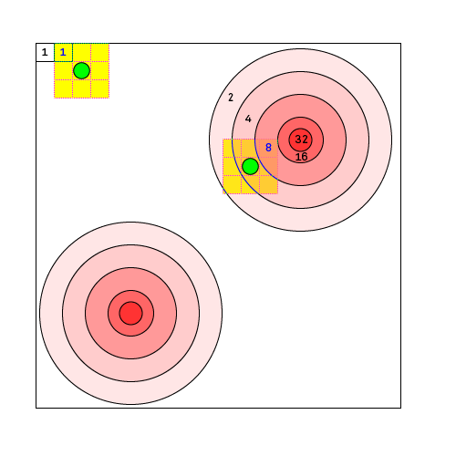

# Simple Amtli Accumulation
> this model is based on the idea that the commoners can gain `resting time` the more they work. The community also assigns different values to different task executed.

## How it works
This model is loosely based on the sugarscape model develpped by Epstein and [find the name]. In their model agents move around a grid world made of ressources with different values that the agents can collect and metabolize for their survival. The model also allows the agents to accumulate the resources, since some cell contain more resources than neede for the survival.

In this model commoners, in order to gain resting time, have to work for the community. Accumulating resting time gives the commoner the ability to skip his duty more often. This model is based on the idea behind the amtli manager, in which commoners when asked to execute a task have to decide whther the do it right away `work`, whthert they `swap` it for another task, or whether they decide to `rest`.

Similar to the sugarsacape this model devides the tasks in more or less valuable, starting from 1 and increasing in exponential way having some peaks of tasks that are valued at 32. The commoners are given `vision` in all directions and a slider will define the eagerness of the commoner to wander toward more valuable tasks or not.

Similar to the [Simple Amtli]() the model measures the happyness and the damage of the community. The happyness regards the agents and how a happy they are in the community.

It decreases when the commoner either:

* steps on an unusable part of the grid world
* wants to rest, but has not enough resting time
* can't move from his positiong

It increases when:

* the commoner is able to rest.
* it fluctuates according to the gini coefficient, that measures inequality in the system

The damage of the community is measured by how often the commoner step on a tile of the grid, when a certain treshold is reached the tile will turn into damaged, and the commoners are supposed to repair the tile, that in turn will give them resting time as compensation for their work. If a damaged tile is stepped to often without being repaired it will turn into unusable and teh commoners won't be able to repair it anymore.

An additional feature will be that commoners are forced to use all their accumulated `resting-time`, maybe at the end of each month

## Expected outcomes

* Less valuable areas will deteriorate quicker, or remain in state of damage
* Agents will congregate toward more valuable areas
* when forced to use their resting time, big part of the agents won't work contributing to deterioration of the community.
